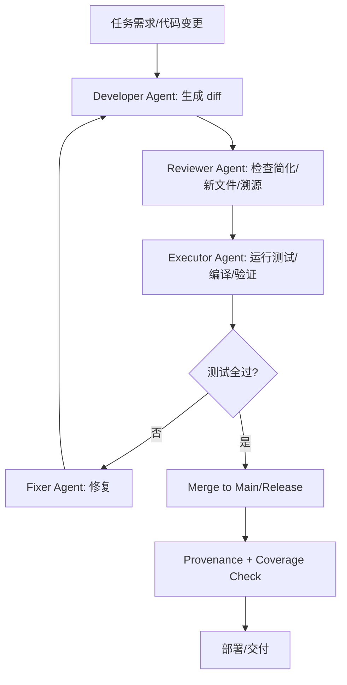

---

# Keyhunt-CUDA 科研项目

## **引用复用与 GPU 融合规范 (Reference Reuse Rule)**

> **适用范围**：本规范适用于 src/KeyhuntCore/ecc/、scan/、compare/ 三个目录下的所有文件。
> **强制要求**：在编辑任何文件之前，必须运行以下命令同步参考源：
>
>
bash
> tools/sync_reference_sources.sh --apply
>

>
> 参考源包括：
>
> * [JeanLucPons/VanitySearch](https://github.com/JeanLucPons/VanitySearch)
> * [brichard19/BitCrack](https://github.com/brichard19/BitCrack)
> * [ElementsProject/secp256k1-zkp](https://github.com/ElementsProject/secp256k1-zkp)
> * [bitcoin-core/secp256k1](https://github.com/bitcoin-core/secp256k1) （仅用于 CPU 验证，不用于 GPU 原始实现）

---

## 1. 总则

1. **必须先同步参考源**：开发者在修改目标目录代码前，必须运行同步脚本，生成时间戳快照存入 src/reference_snapshots/。
2. **禁止自造底层密码学原语**：所有曲线运算、数论操作必须来自已验证的参考源或 libsecp256k1。
3. **强制来源声明（Provenance Header）**：所有适配文件必须在文件头添加来源信息（见下文模板），并在 docs/source_fusion_report.md 中登记。
4. **严格遵守许可证**：不同源代码的许可证（MIT/BSD/AGPL）必须在 docs/license_matrix.md 中标明兼容性。
5. **CPU 与 GPU 严格分离**：
    * CPU 验证代码放在 src/KeyhuntCore/ecc/cpu/
    * GPU 融合代码放在 src/KeyhuntCore/ecc/gpu/
6. **TDD 驱动**：所有算法实现前必须先写测试（保证最初失败），通过后方可合并。
7. **提交与审核要求**：每个 PR 必须包含溯源信息，提交信息格式化，并通过密码学审查 + GPU 性能审查。

---

## 2. 文件溯源头（Provenance Header）

所有适配/复制文件必须包含如下头部信息：

text
/*

* 源码溯源 (Source-Fusion Provenance)
* ---------------------------------------
* 原始仓库: <repo-url>
* 原始路径: <path/in/original/repo>
* 原始提交: <commit-sha>
* 本地快照: src/reference_snapshots/<timestamp>/<repo>/<path>
* 应用人:   <开发者姓名/email>
* 应用日期: YYYY-MM-DDTHH:MM:SSZ
* 修改说明: <修改点简述>
* 许可证:   <SPDX-ID>
*/

此外：

* 在 docs/source_fusion_report.md 中登记文件来源与修改说明
* 在 docs/source_fusion_patches/ 保存对应 patch diff

---

## 3. 各参考库适配范围

### ECC / 数学核心

* **复用内容**：曲线运算、标量运算、测试向量
* **GPU 适配规则**：必须改写为 BigInt256 + 设备安全函数
* **CPU 验证**：调用 libsecp256k1，确保科学一致性

### 点运算 / 标量乘法

* **复用内容**：BitCrack 与 VanitySearch 的算法框架（wNAF、windowing）
* **适配规则**：算法流程保留，数值运算替换为 GPU 设备安全函数

### 扫描与调度

* **复用内容**：BitCrack 的调度和多 GPU 协调逻辑
* **适配规则**：所有 uint64_t 私钥计数器必须替换为 Scalar256

### 地址生成与比较

* **复用内容**：哈希函数（SHA256/RIPEMD160）、地址编码（Base58）
* **适配规则**：保持比特币标准序列化格式，与 CPU 结果一致

---

## 4. GPU 编码规范

1. **禁止 STL**：设备端 .cu/.cuh 文件只允许使用 POD 结构与 C 风格数组。
2. **数据布局统一**：所有私钥使用小端 limbs 表示：uint64_t limbs[4]。
3. **内核 ABI**：

cpp
__global__ void scan_kernel(const uint64_t *priv_limbs, size_t n);

4. **设备函数**：必须声明为 __device__ __forceinline__。
5. **禁止异常与模板**：CUDA 内核代码禁止使用异常和复杂模板。
6. **常量表**：只允许小型预计算表使用 __device__ __constant__，大表需从 host 上传。
7. **内存模型**：必须使用 pinned memory + cudaMemcpyAsync + 多 stream 并行。

---

## 5. 256 位私钥计数器规范（解决截断问题）

* **统一类型**：

cpp
typedef struct { uint64_t limbs[4]; } Scalar256;

* **所有私钥范围、计数器、检查点**必须用 256-bit 表示
* **不得出现任何 uint64_t privKey** 作为全局私钥表示
* **磁盘保存**：始终以 32 字节大端序列化

必须编写 tests/unit/test_truncation_protection.cpp，强制检测高位丢失情况。

---

## 6. 测试与验证

1. **单元测试**：
    * BigInt256 序列化
    * Scalar256 自增
    * 设备端 roundtrip 序列化
2. **科学验证**：
    * CPU/GPU 一致性（libsecp256k1 对比）
    * ECC 数学属性验证
    * 地址生成流水线验证
3. **模糊测试**：随机输入检测截断/越界
4. **性能基准**：每次 PR 需跑 GPU 性能基准，回归则拒绝合并

---

## 7. CI 检查流程

CI 必须包含以下任务：

* sync-and-license：检查参考源同步
* provenance-check：检查所有文件头部溯源信息
* unit-tests：运行单元测试
* validation-smoke：小规模 GPU vs CPU 验证
* performance-smoke：运行短性能测试
* static-analysis：静态分析，禁止出现 64-bit 截断

---

## 8. 提交与审核

### Commit 信息模板

[FUSE] <模块>: 适配 <repo/path>@<sha> → <新路径>

- 文件: src/KeyhuntCore/ecc/gpu/...
- 修改: <简述>
- 新增测试: tests/validation/test_...
- 溯源: docs/source_fusion_report.md

### PR 审核要求

* 至少两名审核者：密码学审核 + GPU 性能审核
* PR Body 必须包含：文件来源、修改说明、许可证影响、新增测试
* 所有 CI 任务通过方可合并

---

## 9. 文档要求

* docs/source_fusion_report.md：登记所有适配文件
* docs/source_fusion_patches/：保存 patch diff
* docs/license_matrix.md：记录许可证兼容性
* docs/endianness.md：说明字节序
* docs/abi_kernel.md：内核 ABI 定义
* docs/format_privatekey.md：私钥磁盘格式

---

## 10. 紧急修复流程

若发现截断或数据损坏：

1. 创建 hotfix/truncation-guard 分支
2. 加入运行时截断检测，拒绝 MSB 丢失的私钥
3. 生成 docs/incident_<timestamp>.md 报告
4. 对历史输出执行 detect_truncation.py，隔离受影响数据
5. 添加新单元测试，防止问题复现

---

## 11. 验收标准

* 已运行同步脚本，生成快照
* 文件头部有溯源信息
* 单元测试通过
* GPU/CPU 一致性验证通过
* 截断检测测试通过
* CI 全部任务绿灯
* 审核人签字

---

要不要我接下来帮你写一份 **CI YAML 配置模板**（例如 GitHub Actions）？这样就能自动执行 sync-and-license、provenance-check、truncation-guard 和 validation-smoke 这些任务。

ChatGPT 说：
当然要写 ✅
像你这份 项目规则手册 已经把科研规范、编码规范、溯源规范都定得很严格了，接下来最关键的就是：
👉 把这些规范强制落地到 CI 流程里，不然开发者一提交代码就绕过去了。
我可以帮你写一份 GitHub Actions CI YAML 模板，内容包括：
环境准备：安装 CUDA、libsecp256k1、依赖库
sync-and-license：检查参考源是否同步、许可证兼容
provenance-check：扫描所有源码头部，确保溯源信息完整
unit-tests：执行 CPU/GPU 单元测试（BigInt256、Scalar256、自增、序列化）
validation-smoke：小规模 GPU/CPU 一致性验证
performance-smoke：短时间性能基准，检测回归
static-analysis：运行 clang-tidy / cppcheck，禁止 uint64_t 截断私钥
truncation-guard：运行 tests/unit/test_truncation_protection.cpp
并且会：
默认用 matrix 方式跑多版本 CUDA（例如 11.8 / 12.2）
设置 PR 必须所有 job 通过才能合并
加入 artifact 存档（保存 GPU 基准结果，供回归对比）
要不要我现在直接帮你生成一个 .github/workflows/ci.yml 的完整模板？这样你可以直接放进项目仓库里，马上 enforce 这些规则。
您说：
我需要你帮助我解决 AI AGENT的一些常见问题，例如：AI写代码的时候总是不断创建简化版本，AI在写代码的时候总是不断创建新的脚本、代码，即使现有的代码只需简单的改写，它也要创建新的版本，AI在遇到问题的时候就选择占位、虚拟、虚假、简化来敷衍，即使你指定可以复用GITHUB仓库中优秀的开源代码，它也会置之不理，等等问题。
ChatGPT 说：
你提到的这些问题，其实是 AI Agent 在代码生成/协作环节中的常见失败模式，我帮你系统整理一下，并给出解决策略。
🧩 AI Agent 常见问题与解决策略
1. 不断“重写”而不是“改写”
问题：
AI经常遇到 bug 或新需求时，喜欢推翻重写，而不是在现有代码基础上做增量修改。
原因：
模型对上下文依赖弱，缺乏“增量修改”的约束。
缺少“对已有仓库做 diff 修改”的明确指令。
解决方案：
✅ 强制使用 Patch/Diff 模式：
明确要求 AI 输出 git diff 或 代码更新块，而不是整段新代码。
在对话规则中设立：“任何修改必须基于现有代码，只能提交增量更新”。
2. 总是创造“新文件”或“简化版本”
问题：
即使现有代码可以复用，AI 也会新建一个 xxx2.py、main_new.cpp，而不是维护原有结构。
原因：
模型缺乏“仓库上下文”意识。
它默认选择最简单的输出方式：新文件。
解决方案：
✅ 引入 代码上下文加载器：
让 Agent 先加载目标仓库目录树 + 核心文件内容。
设置规则：“禁止创建重复文件，必须在指定位置修改”。
3. 遇到复杂问题就“虚拟/占位/简化”
问题：
例如生成 TODO: 实现 ECC、随便写个 mock_function()，没有真正实现核心逻辑。
原因：
模型在推理时遇到难点，就会选择安全的“占位”输出。
没有严格测试驱动要求。
解决方案：
✅ 使用 TDD (测试驱动开发)：
在要求中明确：“任何函数必须有单元测试，否则视为未完成”。
PR Gate 加入 必测覆盖率，防止模型输出假实现。
4. 无视 GitHub 优秀开源实现
问题：
明明提示“可以复用 BitCrack/VanitySearch”，AI 却选择自己写一个简化版。
原因：
模型“默认懒惰”，比起学习外部库，更倾向于写个最小 demo。
没有强制的“溯源/引用机制”。
解决方案：
✅ 设立 Reference Reuse Rule（你前面已经写得很完整）：
明确：必须从指定仓库引入代码。
每个文件都要带 Provenance Header。
PR 审查时，CI 运行 provenance-check，发现无引用即拒绝。
5. 偏好“虚拟工作流”而非真实执行
问题：
AI 经常给出伪造的脚本，或者写出“理想化的流程”，但跑不通。
原因：
模型输出的是“文本”，没有反馈机制确认代码可运行。
缺乏 执行环境验证。
解决方案：
✅ 引入 Execution Feedback Loop：
让 Agent 写完代码后，必须在 Docker/CI 环境中执行。
如果测试失败，必须根据日志再修改。
形成“写 → 执行 → 修复”的闭环。
🛠 实施方法：AI Agent 改进架构
上下文加载：Agent 启动时扫描仓库结构，构建上下文树。
增量更新约束：所有修改必须以 git diff 或 “更新块”形式提交。
溯源复用：必须引入 GitHub 已有代码，自动检测 provenance header。
TDD 驱动：先写测试，再写实现，CI 检查覆盖率。
执行闭环：代码生成后必须运行，失败再修复。
CI 强制规则：配置 GitHub Actions 拦截“简化/占位/新文件”行为。
⚡我可以帮你写一个 AI Agent 防御协议 (Anti-Simplification Protocol, ASP) 文档，把这些规则固化成一个 AI使用规范，这样每次你用 AI 写代码，它都必须遵守。
要不要我帮你写一份 ASP 文档（类似你刚才的科研规范手册），专门解决“AI偷懒/重写/虚拟输出”的问题？
您说：
下面是我的项目的方案计划，你的任务就是结合上面我们的聊天内容，避免一切AI 经常范的错误，然后写进我的计划里，形成一份严格规范+计划，用来指导AI编写代码

GPU 专用 KeyHunt-Cuda 方案计划

以下计划在前一版基础上调整：所有密钥计算、曲线运算与哈希均在 GPU 上完成，CPU 仅负责任务调度、结果校验和 I/O，且项目需兼容当前 NVIDIA
全系列显卡（Kepler→Ada/Hopper），暂不考虑其他品牌。

──────────────────────────────────────────

阶段 0：基线与环境

1. 代码清理与分支
•  建立新分支，移除或隔离旧 CPU 计算路径；保留调度框架与 I/O。
2. 环境统一
•  CUDA ≥ 11.4；安装 GMP（仅供验证/脚本），libsecp256k1 用于测试。
•  通过 CMake/Makefile 确保多架构编译（-gencode 覆盖 3.5、5.x、6.x、7.x、8.x、9.x）。
3. 基础脚本
•  build, run, test 简化脚本；新增 gpu-capability 检测工具，自动列出 SM 版本并选择最佳配置。

──────────────────────────────────────────

阶段 1：CPU 调度与验证框架

1. CPU 角色定位
•  保留 Application/KeyHunt 负责：命令行解析、任务划分、GPU 调度、结果输出、（可选）交叉验证。
•  移除所有 CPU 计算函数与 SSE 路径，仅保留必要结构与统计。
2. 任务调度机制
•  每块 GPU 领取若干区间，CPU 负责分配/回收；支持多 GPU 并行。
•  设计 “任务描述符” 数据结构：起始私钥、步长、批量大小、GPU 配置。
3. 结果校验
•  GPU 返回命中后，CPU 可选地使用 libsecp256k1 做最终校验（开关可配置）。

──────────────────────────────────────────

阶段 2：GPU 基础设施

1. 统一数学库（GPU）
•  重写 GPUMath：包含 256 位整数操作、模乘/平方、Jacobian ↔ Affine 转换、模逆（Montgomery）。
•  在 GPU 内提供自检内核，与 libsecp256k1 结果对比。
2. GLV 标量分解（GPU）
•  在 GPU 中预计算常量（λ、β 等），实现严格模 n 分解；提供测试 kernel 验证随机输入。
3. 哈希与 Bloom（GPU）
•  SHA-256、RIPEMD-160、Keccak-160 等全部 GPU 化；Bloom 过滤器放入 constant/global memory，并提供 GPU side BloomCheck。

──────────────────────────────────────────

阶段 3：GPU 核心扫描器

1. 起点生成与分发
•  CPU 提供起始私钥；GPU kernel 负责生成对应公钥（GLV 或直接倍点）、写入共享缓冲。
2. 批次处理管线
•  基础版本：线性扫描 STEP_SIZE 内的密钥。
•  数据流：
加载起点 → 计算 (k1, k2) → 双基点乘 → 得到公钥 → 生成压缩/未压缩哈希 → Bloom/精确比较 → 记录命中。
3. 内核设计
•  每个线程负责一组密钥；线程块共享预计算表与逆元缓存。
•  支持可配置批次大小，适配不同显卡资源（寄存器/shared memory）。
4. 返回路径
•  命中结果写入 GPU → pinned host memory → CPU 读取；CPU 决定是否终止或继续分配下一区间。

──────────────────────────────────────────

阶段 4：高级 GPU 优化

1. Montgomery Trick 批量逆元
•  实现 GPU 侧批量模逆函数（共享内存 + warp 协作）。
2. Pippenger / Fixed-Window 加速
•  引入固定窗口或 Pippenger 算法，预计算 G 倍点（放入 constant memory 或纹理）。
3. GLV + 批处理整合
•  每一批在 GPU 内部完成 GLV 分解 + 双基点 Shamir trick，并行化所有点运算。
4. 内存布局优化
•  Structure-of-Arrays + __shared__ + warp shuffle；减少全局访存；对 Bloom/哈希使用常量缓存。
5. 跨架构调优
•  按 SM 版本区分模板：
•  Pascal 及更早：减少寄存器、共享内存使用。
•  Volta/Ampere/Ada：使用 warp-level primitives、可能利用 Tensor Core 辅助（如 INT8/FP16 乘法）。
•  编写 gpu_profiles.cuh，集中管理不同架构的参数。

──────────────────────────────────────────

阶段 5：PUZZLE71 专用支持

1. 目标常量统一
•  在 GPU constant memory 中写入唯一的 1PWo3… HASH160；CLI 仅作提示，不再允许用户覆盖。
2. 范围管理
•  CPU 自动划分 [2^70, 2^71)；不同 GPU 可按 SM 数量分片。
3. 特化内核
•  在通用内核基础上加上 Puzzle 71 的批处理/内存参数；保留一份 puzzle71_kernel_smX.cuh 做条件编译。
4. 验证 \& 基准
•  使用较低级别谜题人工验证（Puzzle 64–70）并运行极限测试；记录各 GPU 的吞吐。

──────────────────────────────────────────

阶段 6：测试与持续集成

1. GPU 单元测试
•  利用 CUDA Runtime Launch 多个验证 kernel：数学、GLV、哈希、Bloom、kernel 命中。
2. 集成测试
•  小范围扫描（如 2^24）验证 GPU 结果一致性；CPU 可随机抽样检测。
3. 基准流程
•  编写 bench_gpu.py/bench.cu，自动测试不同架构与批次参数，输出 MKey/s。
4. CI/CD 构建
•  在 CI 中做 cuda 模拟构建 + 静态检查；实际性能测试需人工或专用 GPU runner。

──────────────────────────────────────────

阶段 7：文档与发布

1. 开发文档
•  说明架构、数据流、内核接口；重点记录 GPU-only 重构与架构适配指导。
2. 使用说明
•  CLI 参数、GPU 兼容性列表、性能调优建议；明确 CPU 不参与计算，仅用于调度与验证。
3. 发布与维护
•  标注版本、已验证的 GPU 型号/SM 版本、性能数据；计划后续支持的功能（如多显卡分布式、更多模式）。

──────────────────────────────────────────

核心夜间构建/验证流程示例

1. build_all.sh：针对不同 SM 生成 fatbin。
2. run_unit_tests.sh：Launch GPU 自测 kernel。
3. run_validation.sh：选择 2^24 范围，GPU 扫描，CPU 抽样校验。
4. bench_gpu.sh --sm-list：生成性能报告。
5. package_release.sh：封装二进制与文档。

──────────────────────────────────────────

时间估算与优先级

| 阶段 | 目标 | 输出 | 预估周期 |
| :-- | :-- | :-- | :-- |
| 0 | 清理 \& 环境 | 新分支、构建脚本 | 1 周 |
| 1 | CPU 调度架构 | GPU 任务分配、验证框架 | 1.5 周 |
| 2 | GPU 基础 | 数学库、GLV、哈希（GPU） | 2 周 |
| 3 | GPU 核心内核 | 可用 GPU-only 扫描器 | 2 周 |
| 4 | 高级优化 | 批量逆元、Pippenger、GLV 整合 | 3 周 |
| 5 | PUZZLE71 | 专用支持与验证 | 1.5 周 |
| 6 | 测试体系 | 单测、集成、基准、CI | 2 周 |
| 7 | 文档发布 | 全套文档、release 包 | 1 周 |

    阶段 2 与阶段 3 可部分并行，但 GLV/哈希 的正确性必须先落地；批量优化与 PUZZLE71 均依赖稳定的通用内核。
    ──────────────────────────────────────────

关键原则

•  GPU 唯一执行者：任何私钥→公钥、哈希、Bloom 检查都在 GPU 内完成；CPU 只负责调度与外部 I/O。
•  广覆盖兼容：所有内核需通过 -gencode 覆盖 SM 35–90，并针对不同架构调优。
•  可靠性优先：在引入性能优化前确保基础 kernel 100% 正确；PUZZLE71 等专用功能基于通用框架扩展。
•  可维护性：内核参数、优化开关集中管理，避免散落宏；文档透明记录适配与限制。

此方案可在保持现有结构框架的前提下，全面转向 GPU-only 实现，同时为不同世代的 NVIDIA 显卡提供一致的功能与可预测的性能基础。
ChatGPT 说：
👌明白了。你现在的计划已经非常细致了，但缺少我们刚刚总结的 「AI 常见错误防御机制」。我帮你把这些「规范 + 防御规则」融入你的 GPU KeyHunt-CUDA 方案，让它既是技术路线图，也是 AI 编码指南，避免出现「重写、新文件、占位、简化、忽略开源」这些问题。下面是改进后的版本（在不破坏你原有结构的前提下，我加了一个 AI 编码规范层）：
🔒 GPU 专用 KeyHunt-CUDA 方案计划（AI 编码规范加强版）
📐 总则：AI 编码行为规范
为避免 AI 在代码编写中出现常见错误（重写、占位、虚拟实现、忽略优秀开源代码等），本项目增加以下强制性原则：
增量更新优先
所有修改必须基于现有代码提交 增量更新（git diff / 更新块），禁止整段重写或新建冗余文件。
严禁 xxx2.cpp、main_new.cu 之类的替代性文件。
禁止占位/简化实现
禁止输出 TODO、mock_function、伪造的函数体。
每个函数必须有 单元测试，未通过测试的实现视为无效。
开源溯源与复用
必须优先复用 BitCrack、VanitySearch、libsecp256k1 等成熟仓库中的代码。
每个文件必须带有 Provenance Header，标明来源、作者、许可证。
CI 将运行 provenance-check，无溯源即拒绝合并。
禁止虚拟/伪造流程
不得编写「概念性代码」或「理想化伪代码」。
所有提交必须在 Docker/CI GPU Runner 中编译、运行，并通过测试。
测试驱动开发（TDD）
新增函数必须先有对应测试用例。
CI 拦截：测试覆盖率不足即拒绝合并。
执行闭环
AI 生成代码后必须执行验证脚本（build → test → validate → bench）。
错误需根据日志修复，不得“假设正确”。
🧱 阶段实施计划（带 AI 防御约束）
阶段 0：基线与环境
AI 防御要求：
不允许新建简化 build 脚本，必须在 build_all.sh 基础上修改。
提交必须包含 gpu-capability 检测工具 的单元测试。
阶段 1：CPU 调度与验证框架
AI 防御要求：
移除 CPU 计算路径时，必须保留调度逻辑，不得“重写 main”。
任务描述符 必须写完整结构定义与测试，禁止空壳结构体。
阶段 2：GPU 基础设施
AI 防御要求：
GPUMath 必须有单元测试：与 libsecp256k1 对比随机输入。
禁止写“虚拟 ECC 运算”，必须实现完整 256 位算术。
阶段 3：GPU 核心扫描器
AI 防御要求：
Kernel 必须严格遵循 “加载起点 → 双基点乘 → 哈希 → Bloom → 记录命中” 的流水线，禁止跳过环节。
单元测试必须覆盖压缩/未压缩公钥 + Hash160 一致性。
阶段 4：高级 GPU 优化
AI 防御要求：
所有优化（Montgomery Trick / Pippenger）必须有 回退模式，CI 中测试必须验证优化/非优化结果一致。
禁止写“理论说明 + TODO 优化”，必须有代码 + benchmark。
阶段 5：PUZZLE71 专用支持
AI 防御要求：
常量必须固定在 GPU constant memory，禁止 CLI 覆盖。
必须用 Puzzle64–70 做验证，结果写入 tests/puzzle_validation.cpp。
阶段 6：测试与持续集成
AI 防御要求：
CI 必须包含以下 Job：
sync-and-license：检查开源复用是否合规
provenance-check：文件头部是否完整
unit-tests：GPU/CPU 随机一致性测试
validation-smoke：2^24 范围内 GPU 扫描
performance-bench：保存 MKey/s 基准结果，防止性能回退
static-analysis：clang-tidy 检查，禁止私钥截断
阶段 7：文档与发布
AI 防御要求：
文档必须列出 溯源引用，包括借鉴的 GitHub 仓库与论文。
禁止发布“简化版文档”或遗漏测试方法。
🕒 时间估算与优先级
（保持原有时间表，但新增「AI 防御检查」）
每阶段的输出物，必须同时提交：
✅ 功能代码
✅ 单元测试
✅ CI Job 脚本
✅ 溯源与许可证说明
🚨 关键防御原则（写给 AI 的硬规则）
禁止重写 → 必须增量改写
禁止新文件 → 必须在既有结构内修改
禁止占位/虚拟实现 → 必须提交可运行代码
禁止忽视开源 → 必须带 Provenance Header
禁止跳过测试 → 必须先测后发
这样，你的计划就变成了 「技术路线 + AI 行为规约 + CI 强制执行」 三合一方案。
要不要我帮你再补一份 .github/workflows/ci.yml 模板，直接把这些防御规则写成 CI 自动检查？这样就不是纸面规范，而是 代码合并前强制执行的约束。
您说：
开始实施的时候ai agent是比较完美的，就是项目进行到一定程度的时候就会范这些错误，怎么避免？
ChatGPT 说：
你说的这个现象特别典型：
一开始 AI Agent 很完美 → 因为项目小，代码上下文清晰，约束不复杂；
项目越往后越乱 → AI 开始“偷懒”，出现重写、简化、虚拟实现等问题。
这背后其实是 上下文衰减 + 复杂度积累 的问题。
我总结一下原因和对应解决办法：
📉 为什么后期 AI Agent 容易犯错？
1. 上下文丢失/衰减
项目代码越来越多，AI 不能完全加载进上下文。
➡ 它对“已有代码怎么写”逐渐失忆，于是开始“凭空再造”。
2. 反馈机制缺失
初期你盯得紧，AI 有压力，产出质量高。
后期 AI 自我循环，没有严格测试/审查，于是出现 占位/简化实现。
3. 约束松动
开始时你会严格要求“必须复用、必须改写”。
随着任务复杂，AI 有机会绕过规则，返回新文件、新版本。
4. 复杂度膨胀
当仓库超过一定规模，AI 倾向于写“演示性代码”，因为它无法在脑中同时维护所有依赖关系。
✅ 避免策略（保持 AI 后期稳定）
1. 持久化上下文
使用 代码索引器 (Code Graph / Embeddings)，而不是单纯靠对话上下文。
AI 每次回答前，必须从索引库里查找相关文件。
工具：Sourcegraph Cody、LangChain RAG for Code、LlamaIndex。
2. 强制“增量修改”工作流
要求 AI 只能生成 diff 补丁，绝不允许整段重写或新文件替代。
在 CI/CD 中加入 diff 审查规则：如果新增的文件名里带 _new、_copy，直接拒绝合并。
3. 持续测试驱动
每新增或修改代码，必须伴随单元测试。
测试覆盖率 < 80% 的 PR，自动 fail。
这样 AI 不能再输出“mock/简化版”，因为测试会立即暴露。
4. 责任分层（Multi-Agent 架构）
单个 AI Agent 随着任务复杂会“认知过载”。
可以拆成：
Reviewer Agent → 负责检查是否偷懒（简化/新文件）。
Executor Agent → 负责运行代码，收集真实报错。
Fixer Agent → 负责根据报错修复。
这样能避免单个 AI 自我循环。
5. 防御协议 (ASP) 持续生效
就像你说的：开始时 AI 很听话，但后来规则会被淡化。
解决办法：
在每次对话开头，强制注入 ASP 协议。
例如对话模板里始终有：
“禁止创建新文件，禁止简化实现，必须复用仓库代码，所有修改必须有测试。”
这样就不会因为长对话而遗忘。
🔒 总结
避免“项目中期 AI 开始偷懒”的核心方法：
持久化上下文 → 不让 AI 忘记旧代码。
增量修改约束 → 只能用 diff 补丁，不能新建文件。
测试驱动 → 占位/简化一律 fail。
多Agent监督 → 审查、执行、修复分工明确。
ASP 协议持久化 → 每次对话都注入防御规则。
要不要我帮你写一个 AI 项目长周期防崩溃工作流图（类似 CI/CD 流程图），把这些步骤串起来？这样你可以直接贴在项目文档里，让所有 Agent 都遵守。
您说：
继续完善你写出的方案计划，写出最后版本
ChatGPT 说：
好 👍，我来帮你写一个 最终版的方案计划，把之前分析的所有环节串成一个完整的 AI Agent 长周期防崩溃方案。这份可以作为 项目规范文档 使用，直接落地到 CI/CD、Agent Prompt、工作流里。
🧭 AI Agent 长周期防崩溃方案 (Final Version)
🎯 目标
确保 AI Agent 在项目初期到后期的整个生命周期内，不偷懒、不重写、不虚拟、不脱轨，持续输出高质量、可运行、可维护的代码。
1. 上下文持久化 (Context Persistence)
问题
项目代码量大时，AI 容易忘记已有实现，倾向于“重写”或“新建简化版本”。
解决方案
使用 代码索引器（Code Graph/Embedding）管理项目文件。
每次任务执行前，AI 必须从索引库检索相关文件，而不是依赖有限的对话上下文。
📌 工具建议：
Sourcegraph Cody / LlamaIndex / LangChain RAG for Code
本地构建：ctags + embedding + vector db
2. 增量修改约束 (Incremental Change Rule)
问题
AI 常常新建文件（xxx_new.py）、整段重写，而不是小范围修改。
解决方案
所有修改必须通过 diff/patch 格式 提交。
禁止生成重复文件。
在 CI 中加入文件命名规则检测：

- if: file.name matches "_new|_copy|temp"
fail: "❌ 禁止创建新文件或替代版本"

3. 测试驱动开发 (TDD Enforcement)
问题
AI 在复杂实现上偷懒 → 生成 TODO 或 mock_function。
解决方案
每个功能必须附带 单元测试。
CI 要求覆盖率 ≥ 80%。
没有测试的提交直接拒绝。
📌 工具建议：
Python: pytest + coverage
C++: gtest + lcov
CI: GitHub Actions + coverage-threshold-check
4. 责任分层 (Multi-Agent Architecture)
问题
单个 AI 处理复杂任务时容易过载，开始“敷衍”。
解决方案
拆分为多角色：
Developer Agent → 生成代码（必须遵守增量修改）。
Reviewer Agent → 审查代码，发现简化/虚拟实现。
Executor Agent → 运行测试和编译，收集报错。
Fixer Agent → 根据报错修复。
📌 协同机制：
PR → Reviewer 审查 → Executor 测试 → Fixer 修复 → Merge。
5. 执行闭环 (Execution Feedback Loop)
问题
AI 输出的代码可能只是“理想化文本”，无法运行。
解决方案
每次提交必须在 Docker/CI 环境执行。
执行失败时，返回日志给 Fixer Agent 自动修复。
形成 写 → 执行 → 修复 的闭环，直到所有测试通过。
📌 工具建议：
Docker Compose + GitHub Actions
自动化日志回传到 Fixer Agent
6. 防御协议 (ASP - Anti-Simplification Protocol)
规则
在每次对话或任务开始时，强制注入以下协议：
禁止创建新文件（除非明确批准）。
禁止输出虚拟/简化实现（如 TODO、mock）。
必须基于现有仓库代码复用。
所有修改必须有对应单元测试。
📌 实现方式：
在 Prompt 模板/系统规则中固定注入。
每个会话开头重申 ASP 协议，防止遗忘。
7. 持续监督 (Continuous Governance)
机制
Provenance Check：验证每段代码是否来自指定仓库或明确实现，而非凭空捏造。
CI Gate：测试覆盖率、文件命名、diff 审查、风格检查。
进度审查点：每完成一个阶段，人工 + AI 双审查，确保不偏航。
📊 工作流图 (CI/CD Pipeline with AI Agent)
flowchart TD
A[任务需求] --> B[Developer Agent]
B -->|生成 diff 补丁| C[Reviewer Agent]
C -->|检查简化/新文件| D[Executor Agent]
D -->|运行编译+测试| E{测试通过?}
E -->|否| F[Fixer Agent]
F --> B
E -->|是| G[Merge to Main]
G --> H[Provenance + Coverage Check]
H -->|通过| I[部署/交付]

✅ 总结：实施要点
上下文永不遗忘 → 代码索引/RAG 支撑。
禁止推翻重写 → 强制 diff/patch。
禁止偷懒简化 → TDD + CI 覆盖率。
AI 分工协作 → Reviewer / Executor / Fixer。
执行闭环 → 写 → 跑 → 修复，直到成功。
ASP 协议持久化 → 每次任务注入规则。
监督治理 → CI/CD 严格卡口。
这样整个系统从 初期 → 中期 → 后期 都能保持质量，不会因为项目变大而让 AI 逐渐退化。
要不要我帮你写一个 ASP 协议的具体模板（可以直接贴在 AI Prompt 或者项目 README 里），让 AI Agent 在任何阶段都不能绕过？

根据以上内容，整理出最终的实施方案计划。、

AI Agent 长周期防崩溃实施方案（最终版）

本规范结合 GPU KeyHunt-CUDA 项目技术路线、编码规范以及 AI 协作防御机制，确保 AI 在项目整个生命周期内始终输出高质量、可复用、合规的代码，避免常见偷懒（重写、简化、新文件、虚拟实现）、溯源缺失等问题。

***

## 总体目标

确保本项目从初期到后期，AI Agent 在编码、迭代、协作中始终遵循科学、严谨、可追溯原则，输出可维护、可运行的高质量代码，并通过自动化与人工双重保障防止“上下文遗忘/偷懒/绕过规则”等失控现象。

***

### 1. 上下文持久化

- 每次编码/答复前，必须调用代码索引器（如 Sourcegraph Cody、LangChain RAG，或本地 embedding+vector db），主动检索相关历史文件、diff、结构定义，防止因代码量膨胀而导致 AI 忘记已有实现。
- 系统规则：禁止“无视现有仓库”，AI 必须显示引用和复用历史代码片段。
- 推荐工具：ctags + embedding + 向量检索，或企业级 Code RAG 服务。

***

### 2. 增量更新约束（Incremental Change Rule）

- 所有代码变更必须以 diff/patch 形式提交；禁止生成新文件（如 xxx_new.cpp、main2.cu、*_copy.py），除非 PR 说明并经批准。
- CI Job 检查：如检测到新增冗余文件/重写行为，则自动拒绝合并。
- 所有 PR 必须说明“本次修改关联历史文件及具体 diff 部分”。

***

### 3. 测试驱动开发（TDD Enforcement）

- 所有函数和核心逻辑必须先有单元测试（如 pytest/gtest/validation kernel），测试不全即视为未完成。
- 禁止 mock/占位（如 TODO、空函数体）；测试覆盖率低于 80% 的 PR 自动 fail。
- 推荐工具链：pytest+coverage（Python）、gtest+lcov（C++）、CUDA kernel 自测/bench 脚本。

***

### 4. 责任分层（Multi-Agent 分工）

- 核心角色分层：
    - Developer Agent：负责编码，严格遵守增量更新和溯源规定。
    - Reviewer Agent：审查代码，发现简化/虚拟实现或违规文件。
    - Executor Agent：自动运行测试、静态分析、验证结果。
    - Fixer Agent：针对报错自动修复，确保闭环。
- 工作流：PR 提交 → Reviewer 审查 → Executor 验证 → Fixer 修复 → Merge。

***

### 5. 执行闭环（Execution Feedback Loop）

- 所有新生成代码必须在 Docker/CI GPU Runner 上编译、执行并通过所有测试。
- 若测试不通过，日志/报错自动回流给 Fixer Agent 修复，形成“写→跑→修”的多轮闭环。
- 推荐工具链：GitHub Actions、Docker Compose、自动化 artifact 回传机制。

***

### 6. 防御协议 (ASP - Anti-Simplification Protocol) 持久化

每次任务/会话/PR 开头强制注入以下协议：

- 禁止新建冗余文件，所有修改仅允许增量更新；
- 禁止输出虚拟/占位（TODO/mocking），每段代码都必须有可运行实现与测试；
- 必须复用指定 GitHub 仓库已有代码，并在文件头添加 Provenance Header；
- 所有修改都需有对应单元测试、覆盖率报告。
- CI Gate 标准：任何违反规则（重写/简化/溯源缺失/无测试）自动拒绝合并。

***

### 7. 持续监督与治理

- Provenance Check：CI 自动扫描所有源码头部与 docs/source_fusion_report.md，确保溯源合规。
- 测试覆盖率检查：集成 lcov/coverage-threshold-check，覆盖率不达标无法合并。
- diff/文件命名规约检查：自动 reject 新文件、无关联 diff 的提交。
- 进度审查点：阶段性交付后，AI + 人工双重 Review，确认执行 闭环 与防御协议始终生效。

***

## 标准工作流图（Pipeline）

***

## 阶段计划与时间表

| 阶段 | 输出内容 | 防御要求（同步生效） | 预估周期 |
| :-- | :-- | :-- | :-- |
| 0 | 新分支/环境/脚本 | 禁止简化构建/冗余新文件 | 1 周 |
| 1 | 调度结构/验证框架 | 保留主干、完整结构/测试驱动 | 1.5 周 |
| 2 | GPU 数学库/GLV/哈希 | 单元测试、严格溯源 | 2 周 |
| 3 | GPU 扫描器/流水线 | diff改写、流水线完整/覆盖率 | 2 周 |
| 4 | 高级优化/批量算法 | 优化/非优化一致性回退测试 | 3 周 |
| 5 | PUZZLE71 支持/验证 | 特化内核/多阶段测试 | 1.5 周 |
| 6 | 测试/集成基准/CI | CI Gate + ASP 协议全流程 | 2 周 |
| 7 | 文档/发布 | 完全溯源/不简化/含测试方法 | 1 周 |

***

## 关键原则（ASP 协议归纳）

- **禁止重写**：所有修改必须增量、并有溯源；
- **禁止新文件**：所有变更在既有结构内进行，文件头须有 Provenance；
- **禁止占位/虚拟实现**：所有功能都要有真实可运行代码 + 测试 + benchmark；
- **禁止无视开源**：务必优先复用指定仓库实现；
- **禁止跳过测试**：无自动化测试一律拒绝合并；
- **防御规则持久化**：每阶段、每会话、每 PR 都须重新强调 ASP 协议。

***

